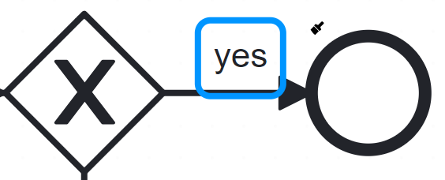
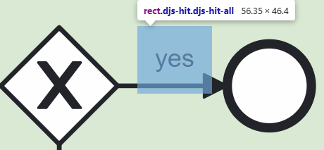

# Design Rules

## Element Positioning
### TLDR;
- Do not Position Elements overlapping it will result in non-clickable areas in the WMP-UI

### Overlapping
>
> The label is positioned over the sequence flow arrow. 
> This will result in less clickable area in the wmp-ui:
>  
> 
>   
> - Always position Elements without overlapping
> 
